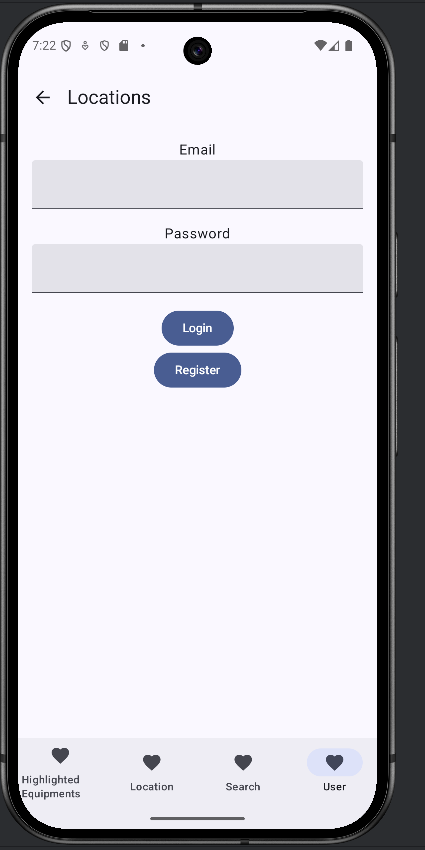

Setup Instruction:
**Open Android Studio, Clone using the web URL.: https://github.com/UG-CS-HKBU/android-equipments-spring-2025-LeonCheung2223.git  **
Function include: 
Find equipment by location

Search Equipment by name

Display Highlighted Equipment 

Login, Logout and Register

Display Rented Equipment.

Reserve and Unreseve Equipment

